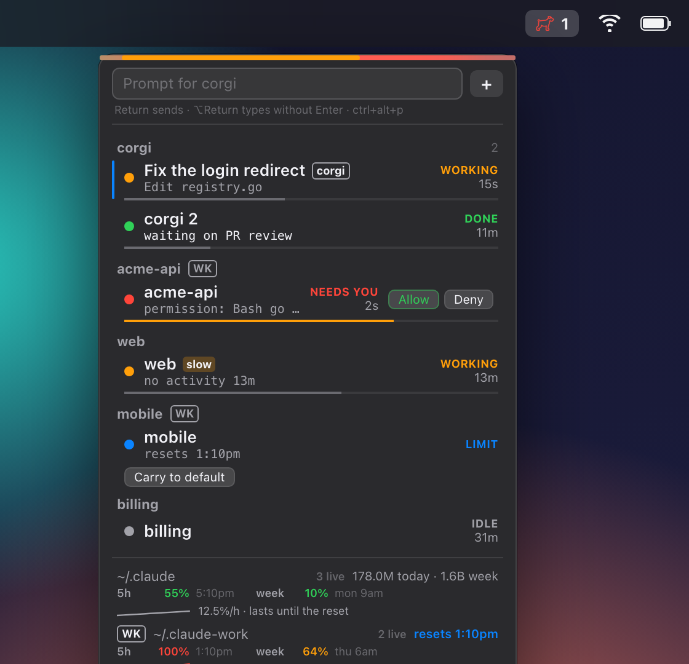
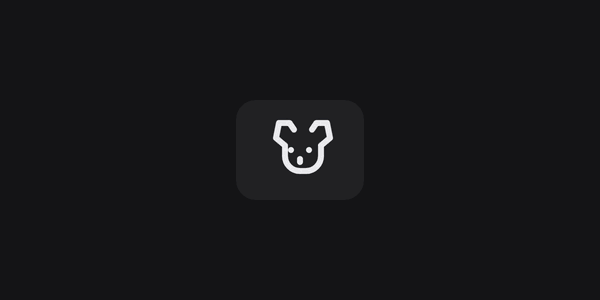
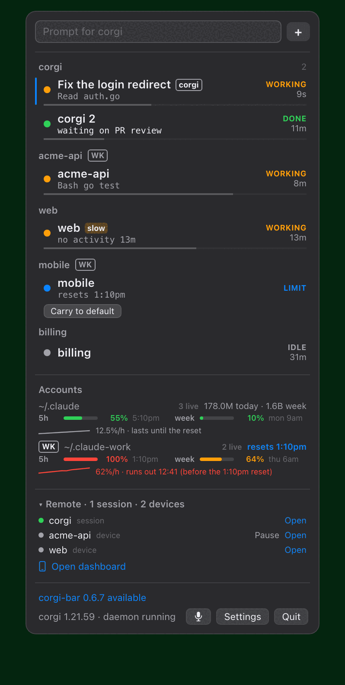
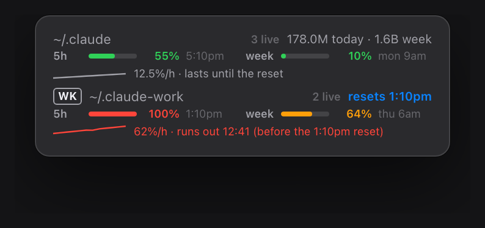
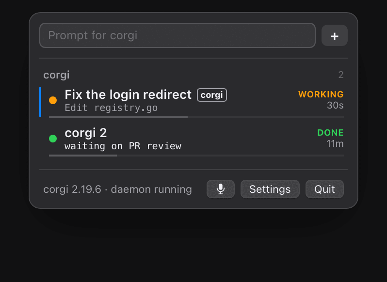
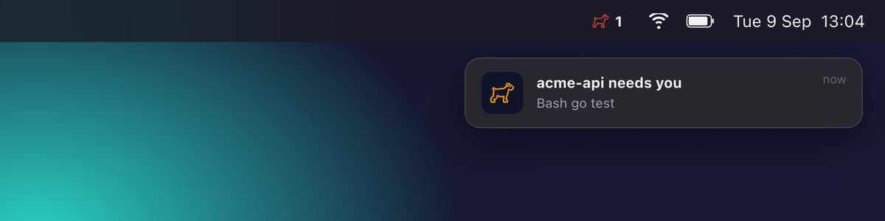

# corgi-bar

Your Claude Code sessions in the macOS menu bar. The dog is amber while a
session works, red with a count when one waits for you, blue when the account
hit its usage limit.

<p align="center"></p>

<p align="center"></p>

## Sessions

One row per session, grouped by workspace. The name is the chat title once
Claude has set one. The line under it is what the session is doing now, or
your note. The thin bar is the context window: orange past 60%, red past
85%. **slow** means a working session has been silent for 12 minutes. The
blue edge marks the session in the front window. Talk and the prompt field
go there.

<p align="center"></p>

Click a row to jump to its window and terminal tab. Right-click for Dismiss,
Pin, Compact context, Mute, Copy id, Open in Finder.

**Allow** and **Deny** show on a row that waits for a permission prompt. Turn
this on in Settings (Approve from the menu bar). Risky commands (`rm -rf`,
`sudo`, `--force`, `drop`) cannot be allowed from here. Answer those in the
terminal.

## Accounts

One block per Claude account (`~/.claude`, `~/.claude-work`, ...): live
sessions, tokens today and this week, the 5-hour and weekly bars from
`/usage` with their reset times, the last five hours as a line, and a
forecast: "runs out 12:41 (before the 1:10pm reset)" in red, or "lasts until
the reset".

<p align="center"></p>

When an account hits its limit, its sessions get a **Carry to** button for
each other account that the workspace lists and that has budget left. The
conversation continues there (`corgi agent carry`). When the limit lifts,
you get a notification.

## Remote

The workspaces the daemon supervises for your phone. A grey dot with
"device" is a machine reachable from the Claude app with no session open
and nothing spent. Green is a session. **Stop** ends a session and keeps
the device. **Pause** stops supervising that workspace
(`corgi agent workspaces resume` brings it back). **Open dashboard** is the
phone launcher.

## Talk and type

**Talk** (`ctrl+alt+space` anywhere): press to speak, press again to send.
The prompt field types into the front session (`ctrl+alt+p` opens it from
anywhere; Return sends, Option+Return types without Enter). `ctrl+alt+n`
jumps to the session that has waited longest.

<p align="center"></p>

The **+** button opens a new `claude` terminal in the front window, under
that folder's account. A notification arrives when a session starts
waiting. Sounds and quiet hours are in Settings. The **Today** tab there
shows your last twelve weeks and today's tokens by model.

<p align="center"></p>

corgi-bar reads the board that [corgi](https://github.com/Andriiklymiuk/corgi)
keeps and runs `corgi agent ...` commands. It keeps no state of its own. The
same board is on Stream Deck keys with
[Corgi Agent Deck](https://github.com/Andriiklymiuk/corgi-agent-deck) and in
VS Code with the
[corgi extension](https://marketplace.visualstudio.com/items?itemName=Corgi.corgi).

## Install

```bash
brew install --cask andriiklymiuk/tools/corgi-bar
corgi agent install        # the daemon, at login
corgi agent track enable   # the hooks that feed the board
```

Open corgi-bar from Applications. Grant **Accessibility** (Talk and the
prompt field press keys) and **Notifications** when asked. Launch at login
is in Settings.

The app is signed and notarized. `brew upgrade --cask corgi-bar` updates
it. The footer says "x.y.z available" when there is a new version. Without
Homebrew, unzip `corgi-bar.zip` from the
[releases](https://github.com/Andriiklymiuk/corgi-bar/releases) into
Applications.

Install the [VS Code extension](https://marketplace.visualstudio.com/items?itemName=Corgi.corgi)
and reload each window once. Then a click lands on the exact tab and Talk
knows which window is in front. For terminal sessions run `/voice tap` once
in Claude Code and bind `voice:pushToTalk` to `ctrl+y` in
`~/.claude/keybindings.json`. The Claude Code panel uses its own `cmd+d`.

## Development

```bash
make build      # swift build -c release
make test       # swift test
make app        # build/corgi-bar.app, ad-hoc signed
make run        # open it
make install    # copy to /Applications
make showcase   # redraw docs/media with Chrome
```

Release: bump `VERSION`, push `main`. CI builds, signs, notarizes, tags
`v<VERSION>` and attaches the zip. The Homebrew cask in
`andriiklymiuk/homebrew-tools` updates itself from the latest release.
